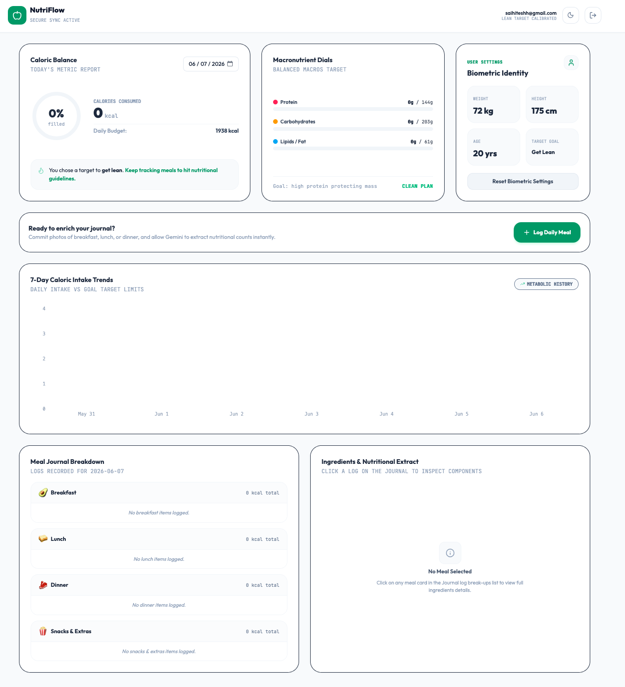

<div align="center">
  
</div>

# NutriFlow: AI-Powered Calorie & Nutrition Tracker

NutriFlow is a modern, minimalist web application that helps you track your meals, analyze macronutrients, and hit your fitness goals. It uses **Google's Gemini AI** to automatically estimate calories and extract nutritional components from meal photos or text descriptions, and **Supabase** for secure authentication and cloud data syncing.

## ✨ Features

- **Visual Snap Logging**: Take photos of your meals and let Gemini AI estimate the calories, protein, carbs, and fat instantly.
- **Macronutrient Dials**: Track your daily intake against your personalized targets (Protein, Carbs, Fat, Calories).
- **Secure Cloud Sync**: All biometric data and food logs are securely stored in a PostgreSQL database with Row Level Security (RLS) via Supabase.
- **Biometric Identity**: Set your weight, height, age, and fitness goals to receive automated target calorie guidelines.
- **Dark/Light Mode**: Beautiful UI with seamless theme switching for comfortable viewing day or night.
- **Meal Journal**: Breakdown of your daily intake categorized by Breakfast, Lunch, Dinner, and Snacks.

## 🚀 Tech Stack

- **Frontend**: React 19, TypeScript, Tailwind CSS v4, Lucide React, Recharts, Framer Motion
- **Backend & Auth**: Supabase (PostgreSQL + Google OAuth)
- **AI Integration**: Google Gemini API (`@google/genai`)
- **Build Tool**: Vite

## 🛠️ Setup Instructions

### 1. Prerequisites
- Node.js (v18 or higher)
- A [Supabase](https://supabase.com/) account
- A [Google Cloud Console](https://console.cloud.google.com/) project (for Google OAuth and Gemini API)

### 2. Clone and Install
```bash
git clone https://github.com/saihitesh-14/Calorie-Nutrition-Tracker.git
cd Calorie-Nutrition-Tracker
npm install
```

### 3. Environment Variables
Create a `.env` file in the root directory and add your keys (see `.env.example`):
```env
# Google Gemini API Key (from Google AI Studio)
GEMINI_API_KEY="your_gemini_api_key"

# Supabase Credentials (from Project Settings -> API)
VITE_SUPABASE_URL="https://your-project-id.supabase.co"
VITE_SUPABASE_ANON_KEY="your-anon-public-key"
```

### 4. Supabase Setup
1. Create a new project in Supabase.
2. Go to the **SQL Editor** and run the schema setup to create the required tables (`profiles` and `food_logs`) along with Row Level Security policies. You can find the migration script in this repository or generate it based on the schema in `src/lib/supabase.ts`.
3. Go to **Authentication -> Providers -> Google** and enable Google Sign-In. You'll need to provide your Google OAuth Client ID and Secret.
4. Add the Supabase Auth Callback URL to your Google Cloud Console OAuth credentials.

### 5. Run the Development Server
```bash
npm run dev
```
Open your browser and navigate to the local URL provided by Vite (usually `http://localhost:3000` or `http://localhost:5173`).

## 📁 Project Structure

- `src/components/`: React components (Dashboard, Login, Onboarding, MealLogger)
- `src/lib/`: API clients (`supabase.ts` for database/auth)
- `server.ts`: Express backend handling Gemini AI multimodal requests
- `assets/`: Images and static assets

## 🔒 Security

This application uses Supabase Row Level Security (RLS) to ensure that users can only read, insert, update, or delete their own data. The Gemini API key is securely managed on the server side (`server.ts`) to prevent client-side exposure.

---

*Note: Please save the provided screenshot of the dashboard as `dashboard.png` inside the `assets/` folder to display it in this README.*